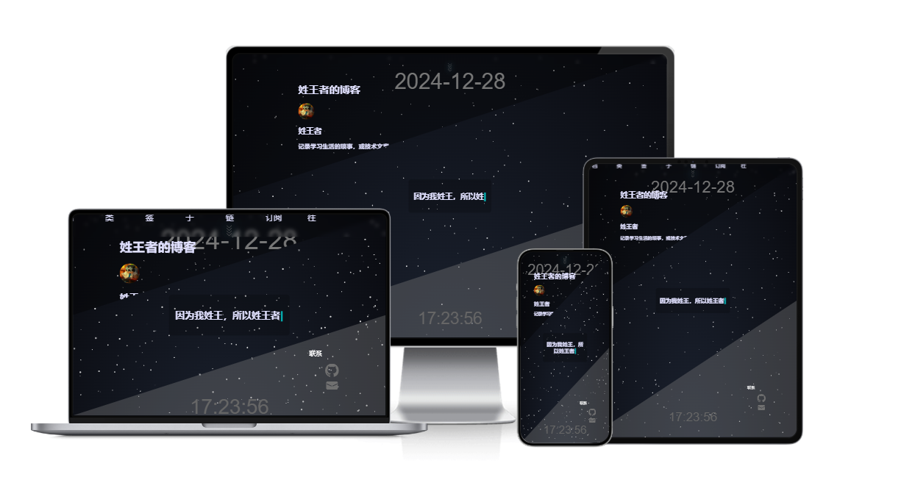
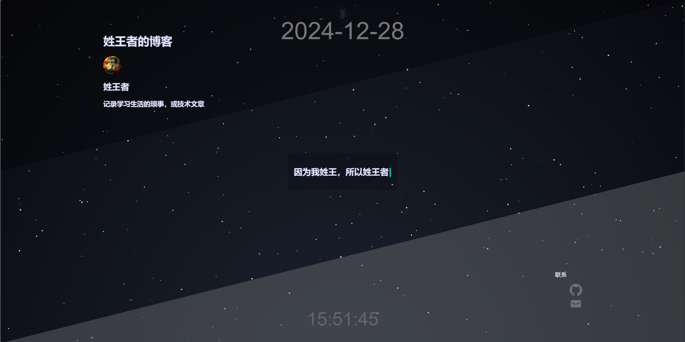

[中文](README.md)
# hexo-theme-wang
A simple dark theme based on hexo
hexo-theme-wang





i18n:zh-CN,zh-TW,zh-HK,en

My Site: [https://xingwangzhe.fun](https://xingwangzhe.fun)

## Thanks to
  [Copilot](https://github.com/features/copilot) for style help
  [hexo-theme-landscape](https://github.com/hexojs/hexo-theme-landscape) for the official hexo theme template structure
  [Mozila](https://developer.mozilla.org/zh-CN/) for the documentation
  ~~Not thanking myself for the three revisions~~

## How to Use
  1. Clone this repository to your hexo themes folder
  
   ```git
   git clone https://github.com/xingwangzhe/hexo-theme-wang.git
   ```

   Or install it using npm as a dependency for Hexo

  ```bash
  npm install hexo-theme-wang
  ```
   2.Change the theme in the _config.yml file under the hexo root directory
   ```yml
      theme: hexo-theme-wang
   ```
   3. Run hexo s to view the effect
   
## Theme Configuration File Explanation (Example)
```yml
## Theme configuration file, image paths are all under the source folder in the theme folder
### Insert content inside the <head> tag, you may need to insert some third-party js libraries, such as tracking code, etc.
favicon:
  src: /wang.icon
head:
  '<script>
  console.log("Hello hexo-theme-wang");
  </script>'

## Avatar configuration 
avatar:
  src: images/avatar.webp # Avatar path
  isround: true # Whether it is circular

## Navigation bar menu separated by ||, the front is the menu name, and the back is the icon name, located in source/images/menu_ico
menu:
  Home: / ||home
  Archives: /archives ||archives
  Categories: /categories || categories
  Tags: /tags || tags
  About: /about || about
  Links: /links || links
  RSS: /atom.xml || rss                   ## Need to install hexo-generator-feed
  Travelling: https://www.travellings.cn/go.html || train

## Display social media links, the front is the name, and the back is the icon name, located in source/images/social_links
social_links:
  Github: https://github.com/xingwangzhe || github
  Email: mailto:xingwangzhe@outloock.com || envelope


  # Need to install hexo-generator-searchdb
search:
  enable: false # Whether to enable the search function
  path: /search.xml # Add a leading slash to indicate starting from the root directory of the website

## Whether to display seconds in time
time:
  show_seconds: true


## Waline comments, need to set serverURL, for details, please visit the Waline official website: https://waline.js.org
comments:
  enable: false # Whether to enable the comment function
  serverURL: ''

## Friend links, need to set name, link, img, description
friend_links:
    - name: Xing Wangzhe
      link: https://xingwangzhe.fun/
      img: https://i.ibb.co/vLC0cft/202406212107148.jpg
      description: Record the trivia of study and life, or technical articles
    - name: 
      link: 
      img: 
      description:

## Footer links, need to set name, link, img
footer_links:
  - name: Travelling - Friend Link Power
    link: https://www.travellings.cn/go.html
    img: https://www.travellings.cn/assets/logo.gif
  - name: Alibaba Cloud Support
    link: https://www.aliyun.com/minisite/goods?userCode=lmvvqvl9
    img: https://i.ibb.co/h7XJkfm/LOGO.png
  - name: Big Shot Forum
    link: https://www.dalao.net/
    img: https://www.dalao.net/img/dalao-svg.svg
  - name: BlogFinder
    link: https://bf.zzxworld.com/
    img: https://bf.zzxworld.com/images/logo-v2.png
  - name: 2024-10-29-133009
    link: https://storeweb.cn/
    img: https://i.ibb.co/tc0z0Y5/2024-10-29-133009.png
  - name: Space Shuttle - Randomly visit BlogsClub member blogs
    link: https://www.blogsclub.org/go
    img: https://www.blogsclub.org/images/shuttle_4.png

## Footer text links, need to set name, link
footer_links_text:
  - name: Text Link
    link: 


```

# Finally, enjoy using it!
