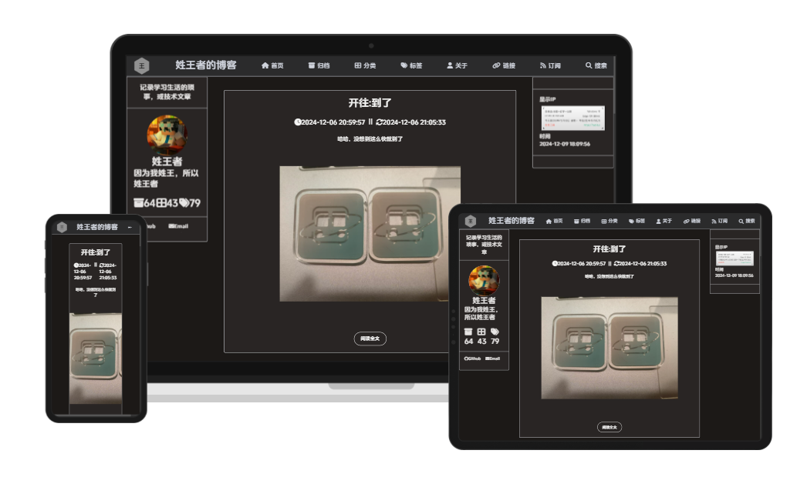

language: [zh-CN](README.md)||en
<center>


# Wang
</center>

## License
Fonts:
 + [Douyin Sans 抖音美好体](https://fonts.zeoseven.com/zh-CN/items/84/) : Licensed under [OFL](FONT-LICENSE)

Code: [AGPL3.0](LICENSE) 
   The project has been switched to AGPL3.0 due to its viral nature, the original MIT license is retained but no longer fully applicable.
 + Main code: [MIT License](MIT_LICENSE)
 + [sodesu comment section](https://github.com/BeiyanYunyi/sodesu): [AGPL3.0](https://github.com/BeiyanYunyi/sodesu/blob/main/LICENSE) 

# Wang - A minimalist Hexo theme



Install in the Hexo directory:
```
npm install hexo-theme-wang
```

The theme will be installed in the `node_modules` directory.
Modify the `theme` to `wang` in the main Hexo configuration file.

## References
Gratitude to the following tutorials, articles, and websites for their contributions!
 + [Hexo Official Website](https://hexo.io/) 
 + [Syntax Highlighting with Highlight.js](https://highlightjs.org/) 
 + [Kimi](https://kimi.moonshot.cn/) 
 + [Developing a Hexo Theme from Scratch](https://liuyib.github.io/2019/08/20/develop-hexo-theme-from-0-to-1/) 

# Development Log
## 2024-11-26
 + Modularize some pages
 + Fix i18n bug
 + Add "Travelling" by default
## 2024-11-25
 + Publishing to hexo-theme
 + npm package release
 + Added extension content to '<head>'
 + Code optimization
## 2024-11-23
 + Responsive UI
## 2024-11-22
 + Added bottom statistics for time and number of visitors
 + Code box optimization
 + i18n internationalization

## 2024-11-21
 + Added comment section at the bottom of articles
 + Added website visit count at the bottom
 + Changed project license to AGPL3.0

## 2024-11-20
+ Added copyright information at the bottom of articles
+ Added tags and categories to the sidebar
## 2024-11-16
+ Added more content to the footer
+ Added links page
  + Implemented internal pagination
## 2024-11-15
 + Added category page
 + Added tag page
 + Refined sidebar
 + Default template rendering
## 2024-11-13
 + Added archive page

## 2024-11-12
+ Left sidebar
  + Site owner information
  + Social links
  + Rotating avatar
+ Content optimization, performance optimization
+ Implemented pagination effect
  
## 2024-11-10
+ Floating box
  + Rounded corners, more aesthetically pleasing
+ Simple footer

## 2024-11-9
+ Article details
  + Underline titles
  + Code highlighting
  + Image centering
+ License information

## 2024-11-6
+ Refined article box
+ Smoothly hide navigation bar

## 2024-11-5
+ Refined article box
  + Article title
  + Article date
  + Article summary
+ Further optimization of the top navigation bar

## 2024-11-3
+ Article preview box
  + Article title
  + Article date

## 2024-11-2        
+ Further CSS design of the top navigation bar
  + Added logo to the navigation bar
  + Added title to the navigation bar

## 2024-10-20
Why not do something when idle? After seeing so many Hexo themes, I couldn't help but itch to create one myself. As the saying goes, **the beginning is the hardest part**, and I only know HTML, CSS, and JS. Node.js, ESJ, and the like are indeed unfamiliar, but no problem, learn as I go.

+ Built the overall structure
+ Simple CSS design for the top navigation bar
+ Drew a simple Logo

~~Flipping through Hexo documentation, examining the layout of the landscape theme~~